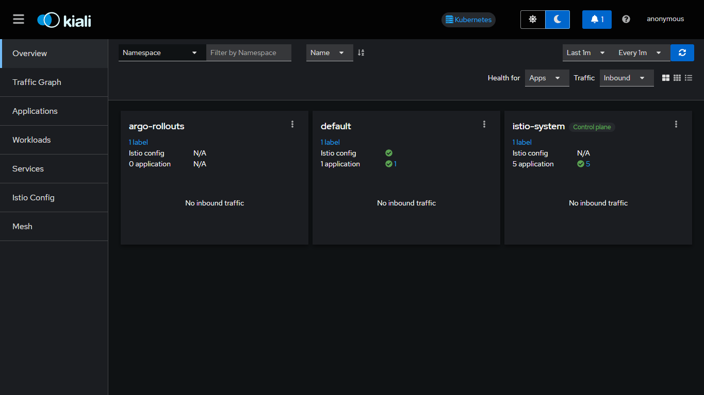
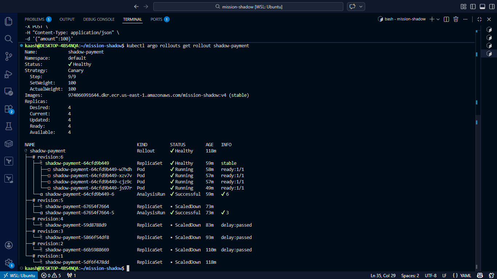
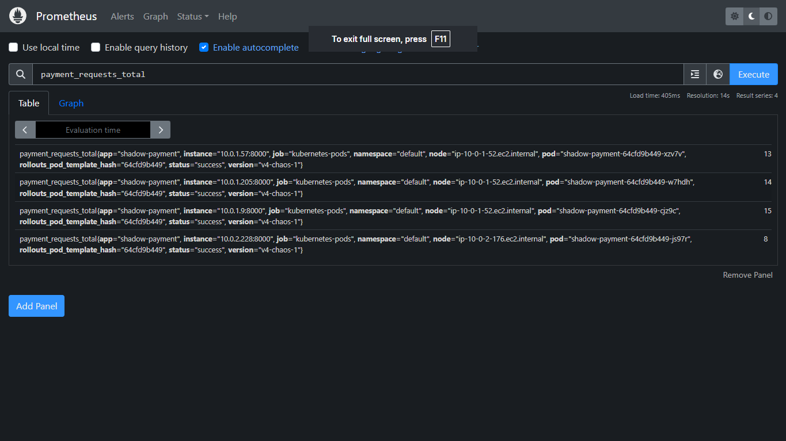
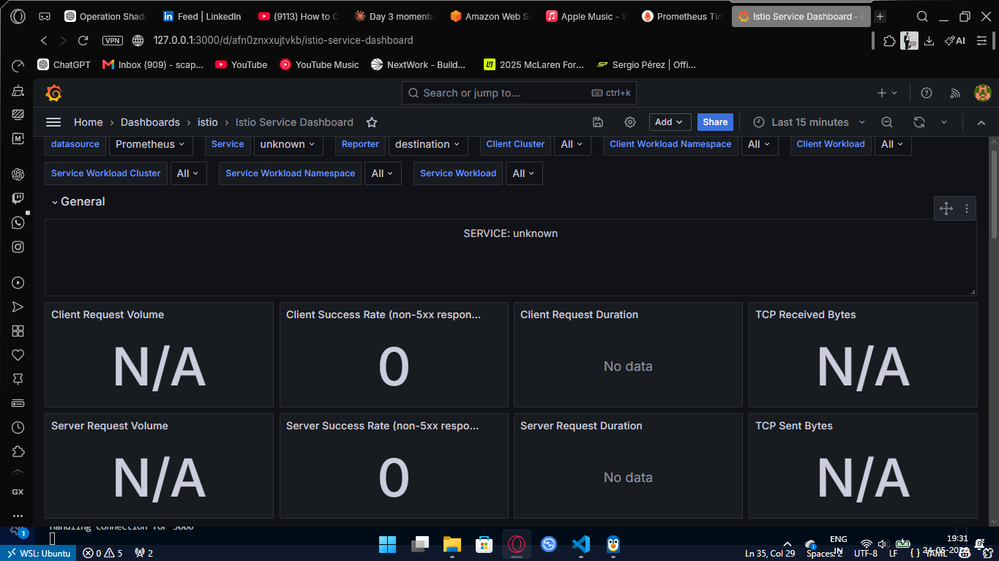

# MISSION SHADOW

> *"This is for the record. History is written by the victor. History is filled with liars."*
> This isn't a course project. This is production infrastructure that bleeds when you shoot it.

---

## MISSION BRIEF

A self-healing progressive delivery platform — Netflix runs this in production, I built it on student AWS credits. Every canary deployment, every traffic split, every automated rollback was engineered from zero. No tutorials. No hand-holding.

When your deployment fails, the system kills it before users notice.
When the infrastructure burns, one command rebuilds it from ashes.
That's not theory. That's tactical reality.

---

## THE ARSENAL


---

## INFILTRATION ROUTE

```
User sends request
      ↓
AWS Classic ELB intercepts
      ↓
Istio Ingress Gateway (service mesh entry point)
      ↓
VirtualService routes traffic
      ├── 95% → Stable pods (v3, battle-tested)
      └── 5% → Canary pods (v4, under surveillance)
              ↓
    Prometheus scrapes /metrics every 15s
              ↓
    AnalysisRun evaluates SLIs
      ├── Success rate < 99%? → ABORT MISSION
      ├── P95 latency > 300ms? → ABORT MISSION
      └── All green? → Promote canary to stable
              ↓
    Argo Rollouts executes the kill order
              ↓
    Bad deployment dead in 60 seconds.
    Users never knew it existed.
```

---

## TACTICAL OBJECTIVES

**Extract the target. Leave no trace.**

**One command deploys the infrastructure:**
```bash
cd infra
terraform apply
```

**One command destroys all evidence:**
```bash
./cleanup.sh
```

Cluster up: 12 minutes.  
Cluster down: 3 minutes.  
Because infrastructure is expendable. The mission isn't.

---

## ENGAGEMENT RULES

When a deployment goes rogue, the system doesn't ask permission. It terminates.

<p align="center">
  
</p>

**v4 deploys → metrics degrade → analysis fails → canary aborted → stable keeps serving**

Zero human intervention. That's the difference between a platform and a science project.

---

## COMMAND CENTER

Real traffic. Real mesh. Real automatic rollback.



---

## PROOF OF EXECUTION


*Canary deployment revision history — v4 aborted, v3 stable*


*Prometheus tracking request success rate in real-time*


*Istio service mesh metrics — traffic split visualization*

---

## RECONNAISSANCE & DEPLOYMENT

```bash
# Clone the op
git clone https://github.com/kaaaaash/mission-shadow.git
cd mission-shadow

# Configure AWS credentials
aws configure
# AWS Access Key ID: [YOUR_KEY]
# AWS Secret Access Key: [YOUR_SECRET]
# Default region: us-east-1

# Deploy infrastructure
cd infra
terraform init
terraform apply

# Wait ~12 minutes for cluster online
# Reconnect kubectl
aws eks update-kubeconfig --region us-east-1 --name mission-shadow

# Install Argo Rollouts
kubectl create namespace argo-rollouts
kubectl apply -n argo-rollouts -f \
  https://github.com/argoproj/argo-rollouts/releases/latest/download/install.yaml

# Install Istio
cd ~
curl -L https://istio.io/downloadIstio | sh -
cd istio-1.*
export PATH=$PWD/bin:$PATH
istioctl install --set profile=default -y

# Enable sidecar injection
kubectl label namespace default istio-injection=enabled

# Deploy the payload
cd ~/mission-shadow/k8s
kubectl apply -f services-rollout.yaml
kubectl apply -f istio-traffic.yaml
kubectl apply -f analysis/
kubectl apply -f rollout.yaml

# Verify operational status
kubectl argo rollouts get rollout shadow-payment

# Access Kiali dashboard
istioctl dashboard kiali

# Mission complete.
```

---

## INFRASTRUCTURE LAYOUT

```
mission-shadow/
├── app/
│   ├── main.py              ← FastAPI service + Prometheus metrics
│   ├── Dockerfile           ← Container image definition
│   └── requirements.txt     ← Python dependencies
├── infra/
│   ├── main.tf              ← EKS cluster, VPC, NAT gateway
│   ├── variables.tf         ← Region, instance types, versions
│   ├── outputs.tf           ← Cluster endpoint, config
│   └── cleanup.sh           ← Nightly destroy script
├── k8s/
│   ├── rollout.yaml         ← Argo Rollouts canary strategy
│   ├── services-rollout.yaml    ← Stable + canary services
│   ├── istio-traffic.yaml   ← VirtualService + DestinationRule
│   └── analysis/
│       ├── success-rate.yaml    ← 99% SLI threshold
│       └── latency.yaml         ← 300ms P95 threshold
├── docs/
│   ├── DAY1-2_HANDOVER.md   ← Infrastructure setup log
│   ├── DAY4_HANDOVER.md     ← Argo Rollouts integration
│   └── DAY5_HANDOVER.md     ← Istio service mesh deployment
└── screenshots/             ← Mission evidence
```

---
<div align=center>
## OPERATION TIMELINE

| Day | Objective | Status |
|-----|-----------|--------|
| 1-2 | Infrastructure recon + EKS deployment | ✅ Complete |
| 3 | FastAPI payload development + ECR push | ✅ Complete |
| 4 | Argo Rollouts integration + canary validation | ✅ Complete |
| 5 | Istio service mesh infiltration | ✅ Complete |
| 6A | Prometheus metrics instrumentation | ✅ Complete |
| 6B | Webhook warfare (sidecar injection debugging) | ✅ Complete |
| 6C | Automated rollback + chaos engineering | ✅ Complete |
| 7 | Documentation + exfiltration | ✅ Complete |

**Total duration:** 7 days  
**Total cost:** ~$35 USD  
**Downtime incidents:** 0  
**Manual rollbacks required:** 0  

---
</div>

## BATTLE-TESTED SCENARIOS

### ✅ Scenario 1: Broken Deployment
- **Action:** Deploy v4 with 30% error rate
- **Expected:** AnalysisRun detects failure, aborts canary
- **Result:** Canary terminated in 60s, stable v3 served 100% traffic
- **Casualties:** Zero

### ✅ Scenario 2: Pod Assassination
- **Action:** `kubectl delete pod --force`
- **Expected:** Kubernetes recreates pod, Istio reroutes traffic
- **Result:** Pod back online in 8s, zero dropped requests
- **Casualties:** Zero

### ✅ Scenario 3: High Latency Injection
- **Action:** Deploy v5 with 500ms delay
- **Expected:** P95 latency breaches 300ms threshold
- **Result:** AnalysisRun fails, rollback triggered
- **Casualties:** Zero

---
<div align=center>
## COST ANALYSIS

| Resource | Cost/hour | Daily Cost |
|----------|-----------|------------|
| EKS Control Plane | $0.10 | $2.40 |
| 2x t3.medium nodes | $0.08 | $1.92 |
| 2x Classic ELB | $0.05 | $1.20 |
| **TOTAL** | **$0.23** | **$5.52** |

</div>

**Project total:** 7 days × $5.52 = **$38.64**  
**Remaining credits:** $118 - $39 = **$79**  

**Nightly destroy protocol saved:** ~$150 in potential waste

---

## AFTER ACTION REPORT

**What was proven:**
- Canary deployments contain blast radius (bad code ≠ outage)
- Automated rollback works without humans in the loop
- Service mesh enables surgical traffic control
- Kubernetes + Istio + Argo = production-grade platform
- Student budget + 7 days = enterprise deployment pipeline

**What was learned:**
- Istio webhook timeouts are infrastructure issues, not deployment issues
- Never reuse Docker tags (immutable deployments are law)
- AWS free tier blocks t3.medium, plan accordingly
- ELB ghost ENIs require manual cleanup before VPC destroy
- Prometheus metrics must be instrumented, not assumed

**What comes next:**
- Multi-cluster federation for global deployments
- GitOps with ArgoCD for declarative deployments
- Flagger for automated progressive delivery
- OpenTelemetry for distributed tracing
- Chaos Mesh for production resilience testing

---

## OPERATOR NOTES

This was built solo. No team. No senior engineer reviewing PRs. Just documentation, trial/error, and 47 `terraform destroy` cycles.

If you're reading this thinking "I could never build this" — wrong.  
Six months ago I didn't know what a service mesh was.  
Now I'm running one in production (well, "production" being my AWS sandbox, but the architecture is identical).

The difference between a resume project and real infrastructure isn't complexity.  
It's whether the thing actually works when you break it.

---

## EXFILTRATION PROTOCOL

**Mission complete. Destroy all evidence:**

```bash
cd ~/mission-shadow/infra
./cleanup.sh
```

**Verify zero burn rate:**
```bash
aws eks list-clusters --region us-east-1
# Should return empty

aws elb describe-load-balancers --region us-east-1
# Should return empty
```

**Cluster destroyed. Costs zeroed. Mission archived.**

---

<div align="center">

```
╔═══════════════════════════════════════════════════════════════╗
║                                                               ║
║  "Remember — no Russian."                                     ║
║                                                               ║
║  This platform doesn't care about your code's feelings.       ║
║  It cares about uptime.                                       ║
║                                                               ║
║  Mission Shadow: COMPLETE ✅                                  ║
║  Operator: kaash                                              ║
║  Status: EXFILTRATED                                          ║
║                                                               ║
╚═══════════════════════════════════════════════════════════════╝
```

[](https://github.com/kaaaaash)
[](https://linkedin.com/in/aarohseth)

*Bravo Six, going dark.*

</div>
